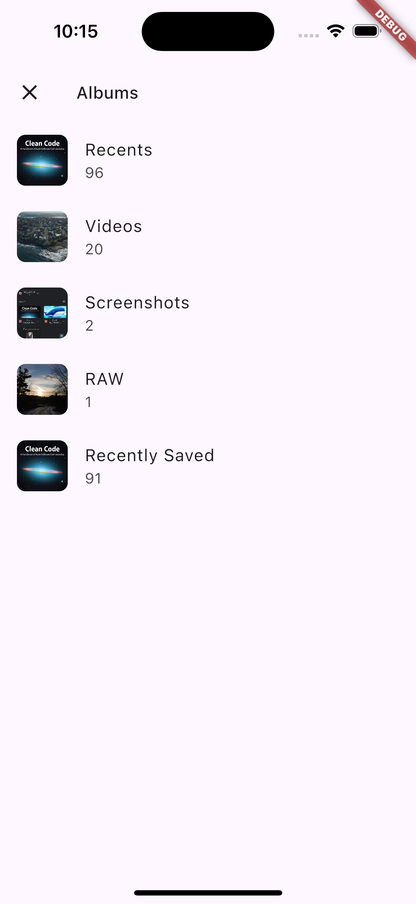
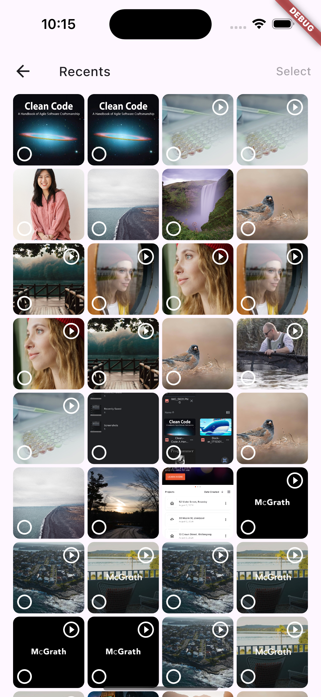

# Simple Media Picker

[](https://pub.dev/packages/very_good_analysis)
[](https://opensource.org/licenses/MIT)

A Flutter plugin for easy media picking with album browsing, multi-selection support, and lazy loading.

## Why This Package?

When using the popular `file_picker` package, selected media files lose their original filenames — they get replaced with temporary cache names. This makes it difficult to preserve metadata or display meaningful file names to users.

`simple_media_picker` solves this by using `photo_manager` under the hood, which provides full access to the original asset metadata including:

- ✅ Original filename
- ✅ Creation date
- ✅ File dimensions
- ✅ Video duration
- ✅ Asset type

## Features

- 🖼️ **Multi-selection** - Pick multiple photos and videos from the gallery
- 📁 **Album browsing** - Browse and select from different albums/folders
- ⚡ **Lazy loading** - Efficient pagination for large media libraries
- 🎬 **Video support** - Display video duration and thumbnails
- 🎨 **Material 3** - Modern Material Design 3 UI

## Screenshots

 

## Getting Started

### Installation

Add `simple_media_picker` to your `pubspec.yaml`:

```yaml
dependencies:
  simple_media_picker: ^0.0.1
```

### Platform Setup

#### Android

Add the following permissions to your `AndroidManifest.xml`:

```xml
<uses-permission android:name="android.permission.READ_MEDIA_IMAGES" />
<uses-permission android:name="android.permission.READ_MEDIA_VIDEO" />
<uses-permission android:name="android.permission.READ_MEDIA_AUDIO" />
<uses-permission android:name="android.permission.READ_MEDIA_VISUAL_USER_SELECTED" />
```

#### iOS

Add the following to your `Info.plist`:

```xml
<key>NSPhotoLibraryUsageDescription</key>
<string>We need access to your photo library to pick media files.</string>
```

## Usage

### Basic Usage

```dart
import 'package:simple_media_picker/simple_media_picker.dart';

final result = await MediaPicker.pickMedia(context);

if (result != null && result.isNotEmpty) {
  for (final asset in result) {
    print('Selected: ${asset.title}');
    print('Type: ${asset.type}');
  }
}
```

### Custom Confirm Button Text

```dart
final result = await MediaPicker.pickMedia(
  context,
  confirmButtonText: 'Select', // Default is 'Done'
);
```

### Working with Selected Assets

The picker returns a list of `AssetEntity` objects from the `photo_manager` package:

```dart
final result = await MediaPicker.pickMedia(context);

if (result != null) {
  for (final asset in result) {
    // Get asset details
    print('ID: ${asset.id}');
    print('Name: ${asset.title}');
    print('Type: ${asset.type}');
    print('Width: ${asset.width}');
    print('Height: ${asset.height}');
    print('Duration: ${asset.duration}'); // For videos
    print('Create Date: ${asset.createDateTime}');

    // Get the file
    final file = await asset.file;
  }
}
```

### Displaying Thumbnails

Use `AssetEntityImage` from the exported `photo_manager_image_provider` package:

```dart
import 'package:simple_media_picker/simple_media_picker.dart';

AssetEntityImage(
  asset,
  isOriginal: false,
  thumbnailSize: const ThumbnailSize.square(200),
  fit: BoxFit.cover,
)
```

## Asset Types

The picker supports the following asset types:

| Type | Description |
|------|-------------|
| `AssetType.image` | Photos and images |
| `AssetType.video` | Videos with duration display |
| `AssetType.audio` | Audio files |
| `AssetType.other` | Other file types |

## Additional Information

### Dependencies

This package uses the following dependencies:

- [photo_manager](https://pub.dev/packages/photo_manager) - Access device media
- [photo_manager_image_provider](https://pub.dev/packages/photo_manager_image_provider) - Display media thumbnails
- [flutter_bloc](https://pub.dev/packages/flutter_bloc) - State management
- [equatable](https://pub.dev/packages/equatable) - Value equality

### Contributing

Contributions are welcome! Please feel free to submit a Pull Request.

### Issues

If you encounter any issues, please file them on the [issue tracker]().

## License

This project is licensed under the MIT License - see the [LICENSE](LICENSE) file for details.